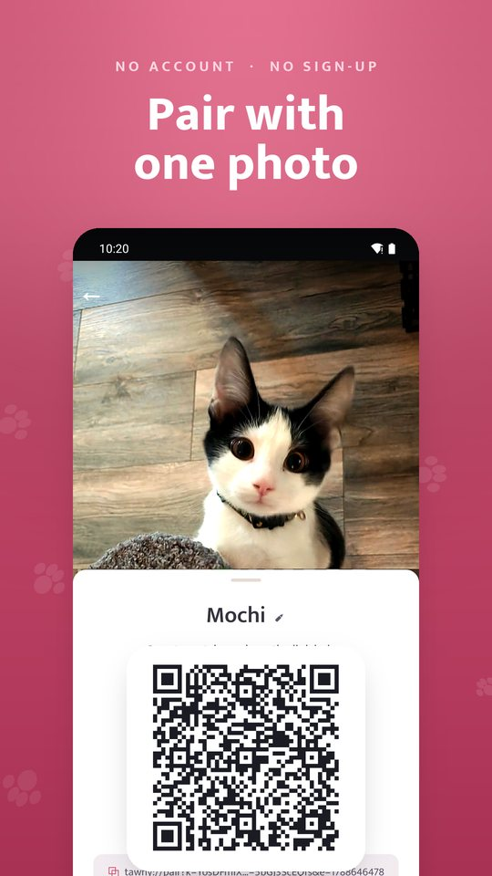
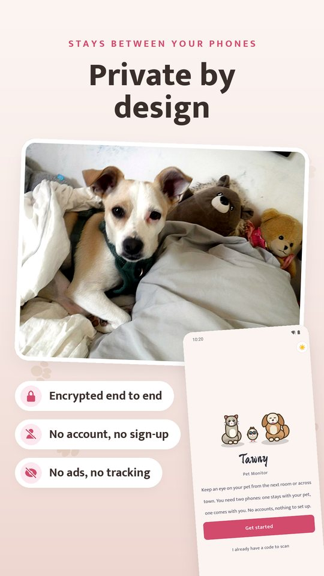
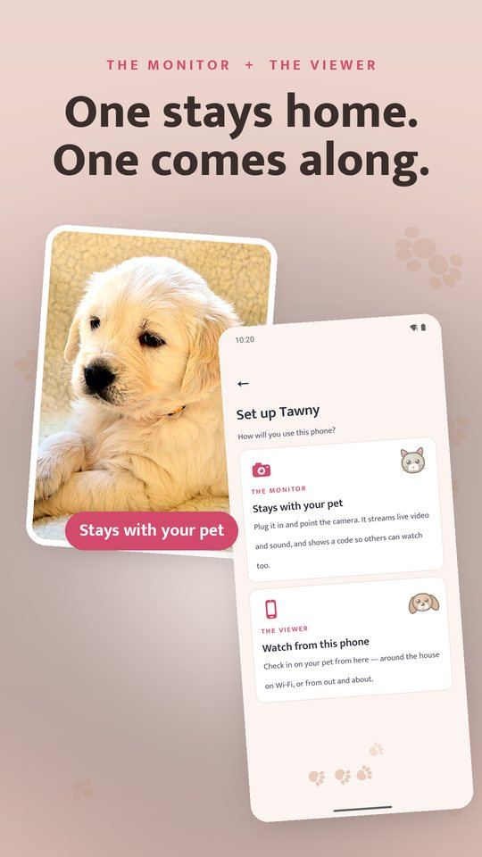
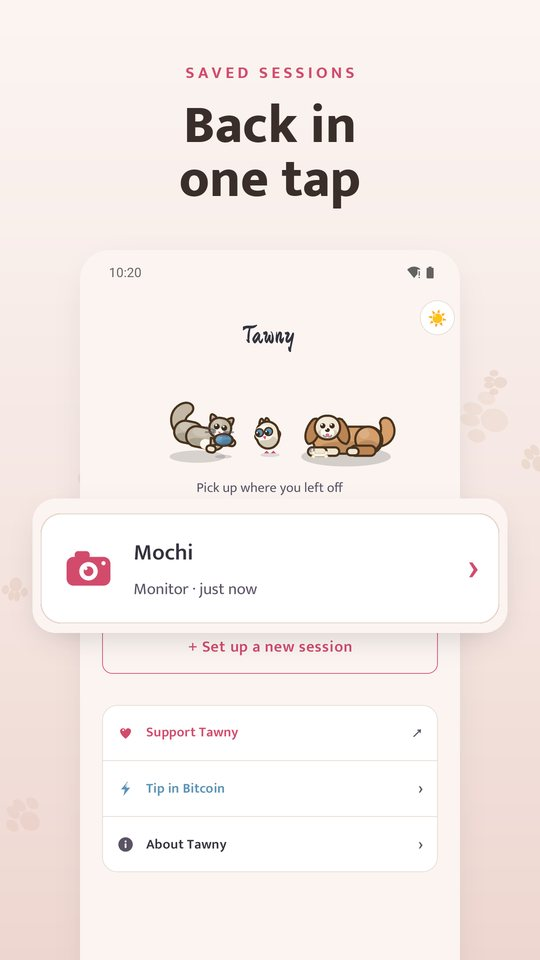
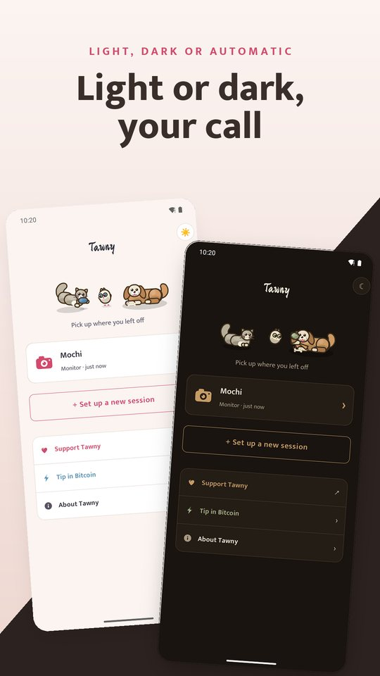

> [!NOTE]
> **Built with AI.** Tawny is made by its maintainer working with Claude, an AI
> model made by Anthropic. Most of the code, documentation and store artwork
> here was written with Claude, under the maintainer's direction. Some people
> avoid AI-built software for ethical, political, professional or personal
> reasons, so you should know that before you install, run or contribute.

# 🦉 Tawny — Pet Monitor

Turn two phones into a private pet camera. One phone stays with the pet (**the
Monitor**) and streams its camera and microphone; the other (**the Viewer**)
watches, listens, talks back, and rings a chime. Pairing is a photo of a QR
code — no account, no sign-up.

Video and audio go **peer to peer over WebRTC**, encrypted end to end
(DTLS-SRTP). On your home Wi-Fi nothing leaves the house: one of your phones does
the job a server would.

<p align="center">
  
  
  
  
</p>
<p align="center">
  
  
  
  
</p>

- **Android app:** [`README-ANDROID.md`](README-ANDROID.md)
- **Self-hosting (container, relay, rendezvous):** the separate [**Tawny Docker**](https://github.com/PressF4me/tawny) repo
- **Security model & residual risk:** [`SECURITY.md`](SECURITY.md)

<p align="center">
  <a href="https://github.com/PressF4me/tawny">
    
  </a>
  <br>
  <sub>Want a viewer with nothing installed? Run <b><a href="https://github.com/PressF4me/tawny">Tawny Docker</a></b> on a box at home
  and watch from any browser on your tailnet.</sub>
</p>

## 😌 Supporting it

<a href="https://ko-fi.com/A6N425ZWFE"></a>
<a href="https://strike.me/@loustrikes"></a>

Tawny is free: no ads, no account, no paywall, nothing locked. The only
recurring cost is the rendezvous/TURN relay that lets the two phones find each
other when they are not on the same Wi-Fi. Chipping in unlocks nothing — every
feature is there for everyone either way.

The two buttons above are the same ones in the app's **About** screen. Anything
else asking for money in Tawny's name isn't us.

---

## 🔍 How it connects

| Situation | Path | Server involved |
|---|---|---|
| Both phones on the same Wi-Fi | The Monitor runs a tiny signalling relay on the LAN; the Viewer connects straight to it. | none — it's the Monitor phone |
| Phones on different networks *(optional build)* | Both phones dial **out** to a small **rendezvous** service that only introduces them. If they can't reach each other directly, an encrypted **TURN** relay forwards the media (it can't read it). | one small always-on service you deploy — see `rendezvous/` |

No inbound ports are opened on either phone in any configuration.

The rendezvous and TURN can be **your own**, set in the installed app rather
than at build time: long-press the version stamp on any screen → Diagnostics →
Servers. If your relay does not answer, the app falls back to the built-in one
instead of losing the remote path. See `README-ANDROID.md`, "Servers
(advanced)".

A **channel** is a name plus a 128-bit key generated on the device. Servers are
told only `sha256(key)`, so channels can't be guessed or enumerated, and the key
never reaches a server. The key rides in the pairing QR / link.

A pairing code is good for **ten minutes**, counted down on the Monitor's own
screen and re-minted in place when it runs out — an old photograph of a QR does
not pair a phone later. Phones that paired inside the window keep working; the
rule is about who can newly join, not how long a session lasts. See
[`SECURITY.md`](SECURITY.md), "Pairing codes expire after ten minutes".

## License

MIT — see [`LICENSE`](LICENSE). Use it, fork it, ship it; keep the copyright
notice. The owlet mascot and the Tawny name are the one exception: they are the
app's identity on the Play Store, so please use your own if you publish a fork.

## Repository layout

```
android/                 the Android app (native shell + bundled web client)
public/                  the web client — index.html, style.css, app.js, i18n.js
public/vendor/           QR encode/decode libraries, vendored for offline use
public/sounds/           chime clips (sounds/_src/ holds the recordings; not shipped)
tools/                   build, release, emulator and probe helpers
docs/diagnostic-reports.md  what an opt-in diagnostic report contains
docs/media/              README screenshots (from the store pack)
README-ANDROID.md        building and running the Android app
privacy-policy.md        privacy policy source text
SECURITY.md              threat model, hardening, residual risk
```

## 🤓 Self-hosting

The self-host relay (`server.js`), the rendezvous Worker, and the container —
automatic HTTPS over Tailscale and an optional bundled TURN relay — live in the
separate [**Tawny Docker**](https://github.com/PressF4me/tawny) repo, which vendors
`public/` from here.

No CDN, no web fonts fetched at runtime, no analytics — the app works on a
network with no internet at all.
